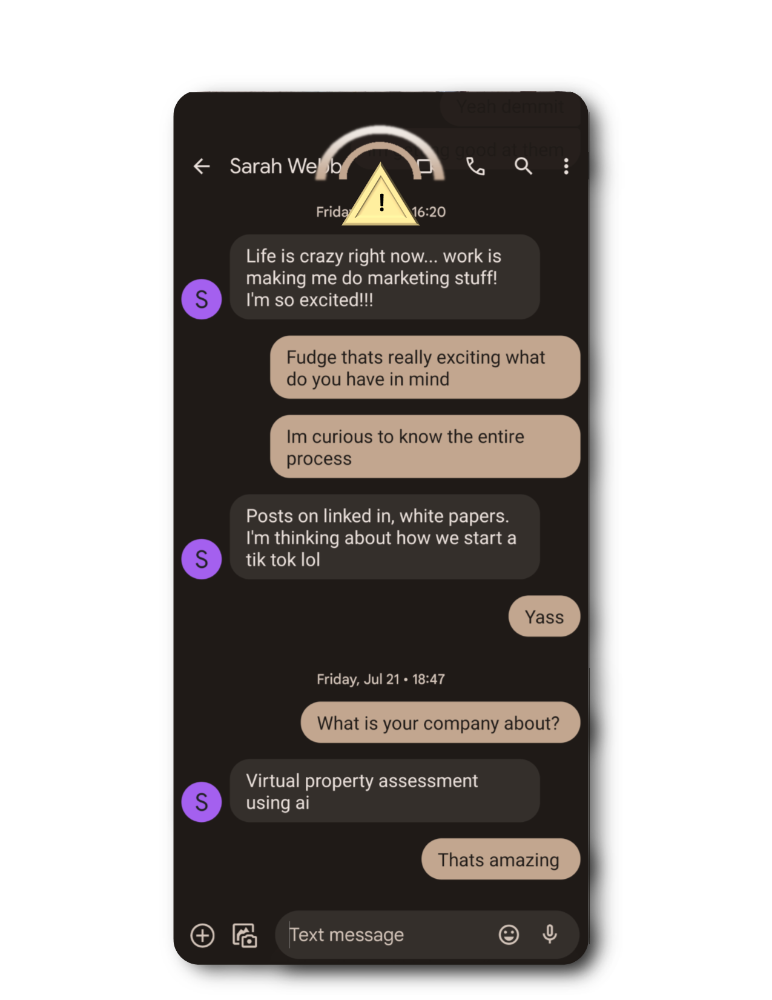

# Pixel Messages: Enhancing User Safety and Satisfaction Proposal

## Introduction:
As a passionate junior software engineer inspired by Google's innovative spirit, I present a proposal to elevate user safety and satisfaction by integrating visual cues into the Pixel Messages app.

## Problem Statement:
In today's smartphone-driven world, distracted walking while texting poses safety concerns, leading to potential accidents and injuries.

## Proposed Solution:
I propose incorporating unobtrusive visual cues into Pixel Messages to remind users to stay vigilant while preserving the seamless messaging experience.

## Features For Consideration:

### 1. Transparent Overlay
A semi-transparent overlay on the texting interface allows users to see through the app and be aware of their surroundings.

### 2. Peripheral Warning
A radar-inspired overlay at the top of the phone subtly draws attention to the periphery when texting and walking.

### 3. Haptic Feedback
Gentle haptic vibrations provide users with subtle physical cues that align with their messaging actions.

### 4. Proximity Alerts
The app utilizes sensors to detect obstacles and provides timely pop-up notifications or warning sounds.

## User Experience:
Our focus is to create a seamless and safe messaging experience, empowering users to stay connected responsibly.

## Customization Options:
Users can adjust the intensity of visual cues or disable them according to their preferences.

## Data and Privacy Considerations:
We prioritize user privacy, ensuring all data collected is anonymized and used solely for enhancing safety.

## Beta Testing:
We plan to conduct beta testing to gather valuable feedback and refine the features.

## Conclusion:
With Pixel Messages, we aim to revolutionize mobile communication by prioritizing user safety and satisfaction. As a junior software engineer, I am excited about the prospect of being part of this transformative project, contributing to its success under your esteemed mentorship.

_**Note**: The vision images are conceptual representations and subject to iterative improvements during development._
