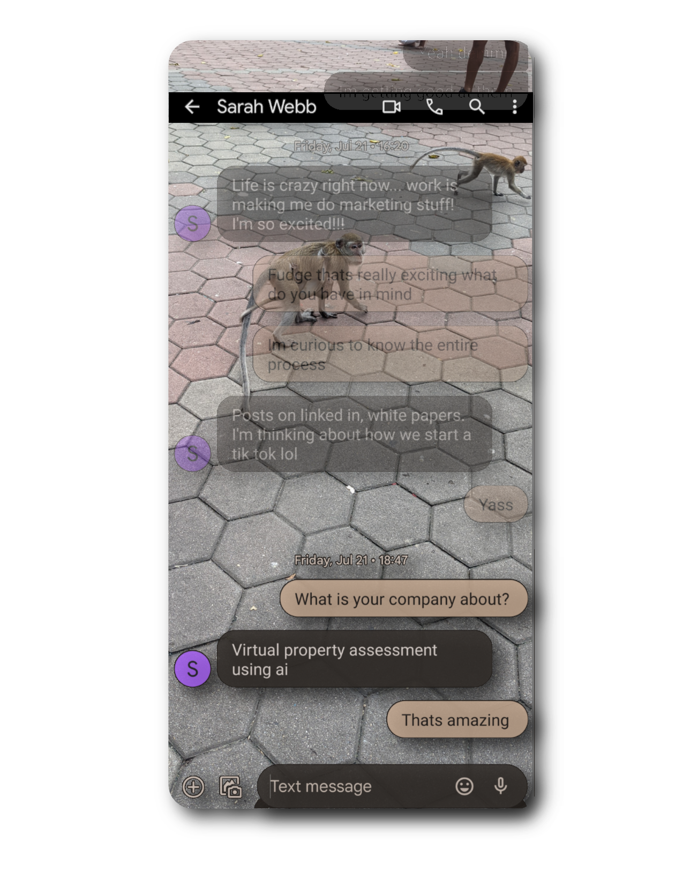
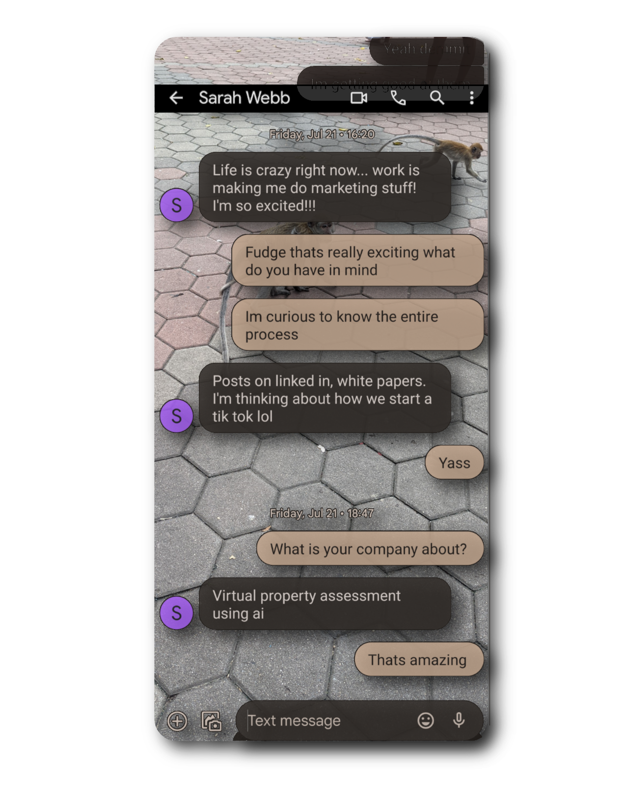
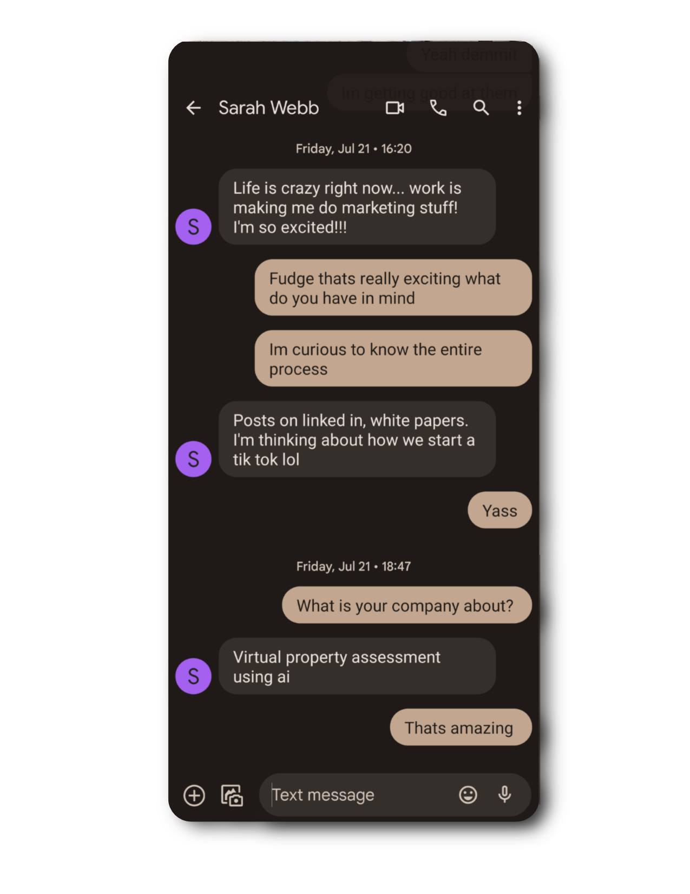
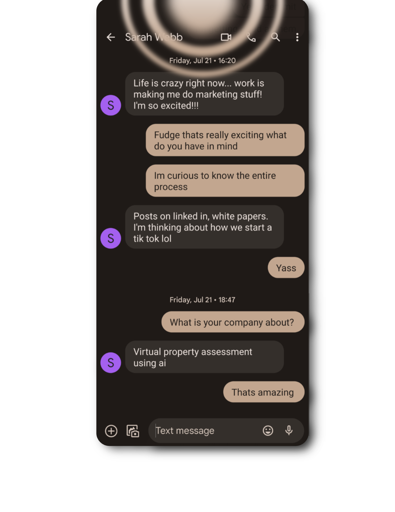
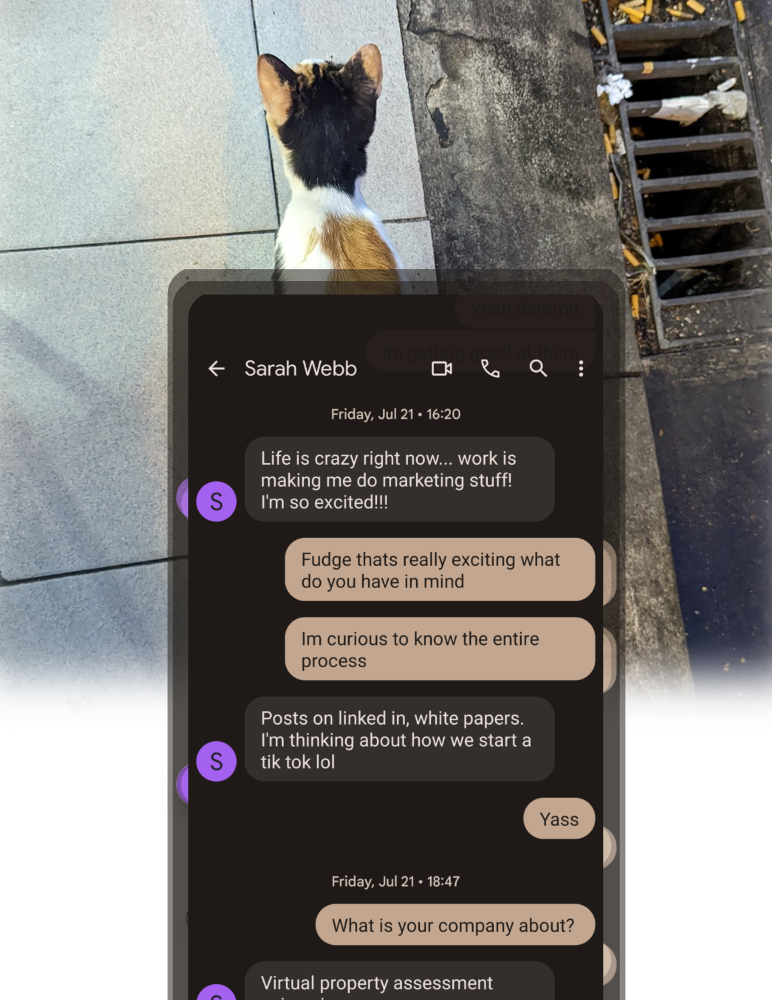

# Enhancing User Safety and Satisfaction: A Pixel Messages Proposal

## Introduction:
As a junior software engineer inspired by Google, I am excited to propose a solution to improve user safety and satisfaction through the integration of visual cues into the Pixel Messages app.

## Problem Statement:
Smartphones have become an integral part of our lives, providing seamless communication through messaging apps. However, distracted walking has become a significant safety concern, with users engrossed in texting while navigating busy streets, parks, or public places, leading to potential accidents and injuries.

## Proposed Solution:
I am proposing the integration of visual cues into Pixel Messages to help users stay aware of their surroundings when texting and walking. By adding these unobtrusive visual cues, we can gently remind users to be cautious while preserving the core messaging experience.

## Feature Description 1: Transparent Overlay
Display a semi-transparent overlay on the texting interface, allowing users to see through the app and stay aware of nearby objects or pedestrians.

### Walking

### Slow walking

### Static

## Feature Description 2: Peripheral Warning

The peripheral warning feature introduces a subtle yet effective visual cue to draw the user's attention to the phone's periphery when texting and walking. We have creatively designed a radar-like overlay with circles at the top of the phone screen to resemble a radar system.

### Peripheral Warning:

As the user starts walking and texting, the radar overlay activates and gently pulses with a soft glow. The circles appear to detect motion, mimicking the behavior of a radar detecting objects. This animation helps users maintain awareness of their surroundings without interrupting their messaging experience. The peripheral warning provides an intuitive and non-intrusive way to remind users to stay vigilant while walking and texting.

The color scheme and animation have been thoughtfully designed to complement the overall Pixel Messages app aesthetic, ensuring a seamless integration of the peripheral warning feature.

By incorporating this peripheral warning feature, we aim to enhance user safety by promoting responsible mobile device usage while fostering an enjoyable messaging experience.

## Feature Description 3: Haptic Feedback
Introduce gentle haptic feedback when users text and walk simultaneously, serving as a non-intrusive reminder of the potential risks.

### Haptic Feedback 
By introducing gentle haptic vibrations, users can sense subtle physical cues that align with their messaging actions.

## Feature Description 4: Proximity Alerts
Utilize the phone's sensors to detect obstacles in the user's path and notify them through pop-up notifications or warning sounds.

_**Note**: The vision image is a conceptual representation and does not necessarily reflect the final implementation. The actual design and appearance may be subject to iterative improvements and user feedback during the development process._

## User Experience:
The primary focus is to create a seamless user experience that prioritizes safety without sacrificing the convenience of text messaging. These visual cues will empower users to stay connected responsibly, reducing the risk of accidents and ensuring a more satisfying messaging experience.

## Customization Options:
Recognizing that user preferences may vary, we plan to incorporate customization options. Users can adjust the intensity of visual cues or disable them if they prefer a more traditional messaging experience.

## Data and Privacy Considerations:
We understand the importance of user privacy and data protection. All data collected for implementing these features will be anonymized and used solely for enhancing user safety within the app.

## Beta Testing:
Before releasing the updated version of Pixel Messages, we propose conducting a beta testing phase. Feedback from real users will be invaluable in fine-tuning the features and addressing any potential issues.

## Conclusion:
At Google, we are committed to making our products innovative, safe, and user-friendly. By incorporating these visual cues into Pixel Messages, we can promote responsible usage and enhance user satisfaction with the app.

Thank you for considering this proposal. I am eager to be part of this transformative project from a learning capacity, shadowing, questioning, and contributing to the best of my abilities. Your guidance and mentorship would be invaluable in my journey.

Sincerely,
[Your Name]
Junior Software Engineer, Google
